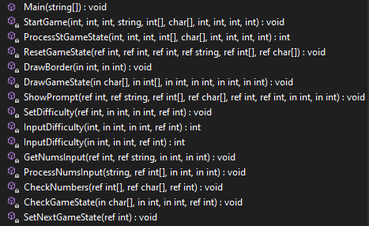

# PR1 - Mastermind, Cristian Sala

## Robust

El programa no dona errors ni conté traçes, les línies relacionades al bug que vaig trobar han sigut esborrades, 
s'ha optimitzat el millor possible i no dona errors. A més a més, accepta entrades incorrectes i no provoquen un "crash", 
sinó que et demanen l'input de nou.

## Claredat i ordre

El codi s'ha organitzat per grups a les constants, i per ordre d'execució dins del possible.
Hi ha alguns salts enrere segons els estats actius, però en general s'executa de dalt cap avall.

No s'han posat gaires comentaris, però sí noms descriptius als mètodes i variables.

## Variables i constants

S'ha evitat fer servir l'ús de literals a les definicions, exceptuant un offset per ancorar els texts, ja que varia en 
cada cas.

## Estructures de Control i gestió d'errors

S'han controlat els errors i el programa acaba amb codi 0 quan l'usuari introdueix "99" per sortir sigui al menu, 
o durant l'input de nombres. No s'ha forçat la sortida de funcions.

Si es posen nombres per sobre o per sota de la dificultat especificada al menu et dona error i et demana que ho emplenis 
de nou.

Si on demana els nombres no s'introdueix cap nombre vàlid, conservarà la pista i nombres anteriors a canvi de gastar 
un intent.
Si, en canvi, s'introdueix parcialment (per exemple 2 nombres vàlids només), emplenarà les caselles per ordre d'esquerra 
a dreta, i mantindrà els 2 últims de l'intent anterior com a pista.

## Disseny modular

El codi ha sigut separat en funcions, i aquestes s'han ordenat per ordre d'execució de dalt cap avall.

## Jocs de Proves
[Excel de jocs de proves](https://docs.google.com/spreadsheets/d/1yN1KtUyS_m5CoPf8sLm29wBd9477_Evke3AbBD4fsqY/edit?usp=sharing)

- 
- StartGame: 
- SetDifficulty: 
- InputDifficulty: 
- CheckGameState:  

Els jocs de proves inclouen les funcions principals, SetDifficulty i cada overload de InputDifficulty conté 3,
i CheckGameState en té 2, un es guanya i un on es perd.

## UX/UI

He fet una interfície per consola, que malauradament degut a un bug actiu no es veu si es compila a Visual Studio 
o en un executable. 
[Issue 13232](https://github.com/microsoft/terminal/issues/13232), i [issue 15654](https://github.com/microsoft/terminal/issues/15654)

Si s'executa en un IDE com Rider, que tè un terminal propi per debug i es canvia la mida de la finestra entre execucions, 
s'adaptarà a la mida de la finestra, ancorant els texts a cada cantonada i respectant el marge de la vora.

## Lliurament

Inclourà el ".gitignore", l'executable i el README.md junt amb els arxius de la solució (els no ignorats).

## Extra 2 i 3 (menú i estètica)

El joc tè un menú on es retorna quan es guanya o es perd. Ha sigut estilitzat amb caràcters ASCII que s'agafen de la 
constant "WindowSymbols". Els texts s'ancoren a les cantonades, i si es debuga a un IDE com Rider, el qual inclou una 
consola que es pot canviar de mida entre execucions, s'adaptarà i ho ancorarà amb els marges preestablerts.

